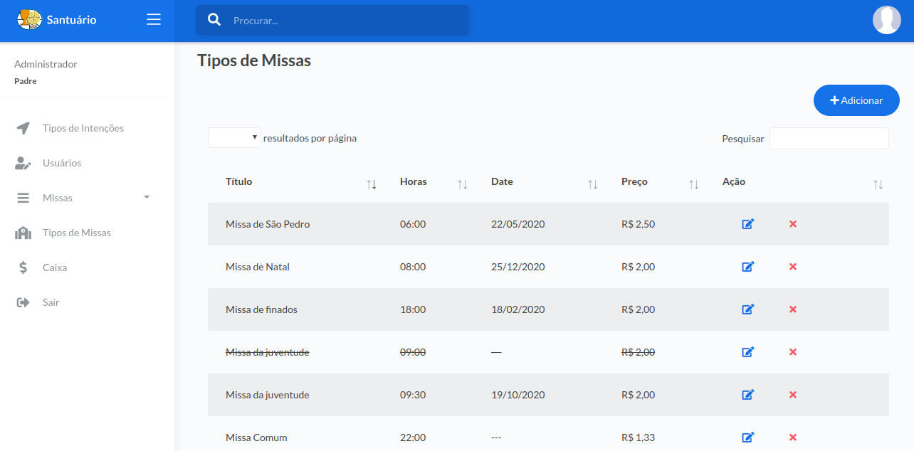
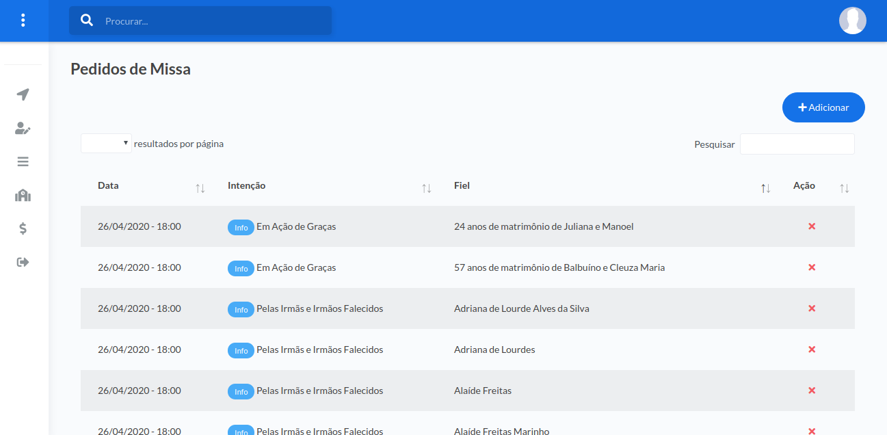
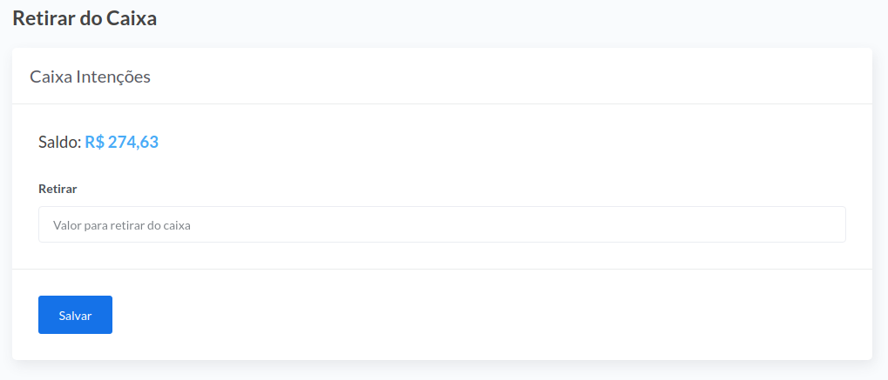

# Fin-missa – Sistema Financeiro Católico

Esse sistema tem como objetivo o controle da parte financeira de igrejas Católicas Apostólica Romana e gerar **impressão dos pedidos de missa**, para leitura na abertura da missa.

A principio projetado para controlar o financeiro referente a:

- Pedido de intenção de missa;
- Doação;
- Apadrinhamento.

# Screenshot

## Login


---

## Tipos de missa



---

## Tipos de intenções


---

## Pedidos de missa



---

## Impressão de pedidos de missa

### Tela de impressão


---

### PDF Pedidos de missa


---

## Caixa


---

## PDF Movimento do Caixa


---

## Retirada do caixa



---

## Diagrama de entidades relacionais


---

# Funcionamento

Nessa primeira versão esta disponível somente o módulo de **Pedido de intenção de Missa**.

O sistema tem controle de acesso em dois níveis. Nível 1 _Padre_ e nível 2 _Secretária_. Esse controle é feito diretamente no código fonte, não tendo uma tabela no banco de dados com essa função.

Os **pedidos de intenção de missa** são agendados em missas futuras e ou recorrentes, previamente cadastras, onde pode-se colocar um valor para cada pedido. Isso irá gerar um caixa para a paróquia.

É possível tirar um relatório dos **pedidos de intenção de missa** para fins de leitura durante a _Santa Missa_.

No banco de dados padrão já vem cadastrado alguns tipos de intenções, porem existe CRUB para esse controle.

Nessa versão as retiradas do caixa poderá ser realizada pelo usuário nível 1 (Padre), porem o sistema não controla as retiradas, somente abate no caixa.

Como template do sistema foi usado o [Atlantis Lite](https://www.themekita.com/atlantis-lite-bootstrap-dashboard.html) da [Theme Kita](https://www.themekita.com), em sua versão _free_.

Alguns componentes do layout padrão foram `<!-- comentados -->` pelo fato de não estarem implantado nessa versão ou por não usar. No entanto é facilmente colocado em uso removendo os comentarios.

# Instalação

## Requisitos

- Servidor Web
- PHP 7
- MySql 5.7
- Compose

## Instalação e configuração

1. Clone o projeto;
2. Execute o compose na raiz do projeto, para baixar as dependências `php composer.phar update`;
3. Suba os arquivos para sua hospedagem ou em seu servidor _web_ local, caso esteja rodando em máquina local;
4. Crie um banco de dados em MySql e execute o script SQL localizado em `projeto-db/schema.sql`, `projeto-db/update-xxx.sql`. Execute na sequencia correta;
5. Configure em `source/Config.php` de acordo com seus dados:

```
"root" => "http://dominio.com.br[/fin-missa]" // [/fin-missa] somente se estiver em um subdiretório
"domain" => "fin-missa.dominio.com.br",

"host" => "localhost",
"port" => "3306",
"dbname" => "nome_do_DB",
"username" => "usuario_do_DB",
"passwd" => "senha_do_DB",
```

# Usuário padrão

No banco de dado já vem com um usuário para acesso padrão, esse deverá ser trocado a senha após o primeiro acesso, por motivo de segurança.

- Usuário: admin
- Senha: admin

---

Esse sistema foi desenvolvido por Carlos Valter - [Linkedin](https://www.linkedin.com/in/carlos-valter/) - sem fins lucrativo. Esteja a vontade para instalar em sua paróquia sem fins lucrativos.

_Developer by Carlos Valter dos Santos Ferreira_

_E-mail carlosvalter@hotmail.com_

**Licença MIT**
